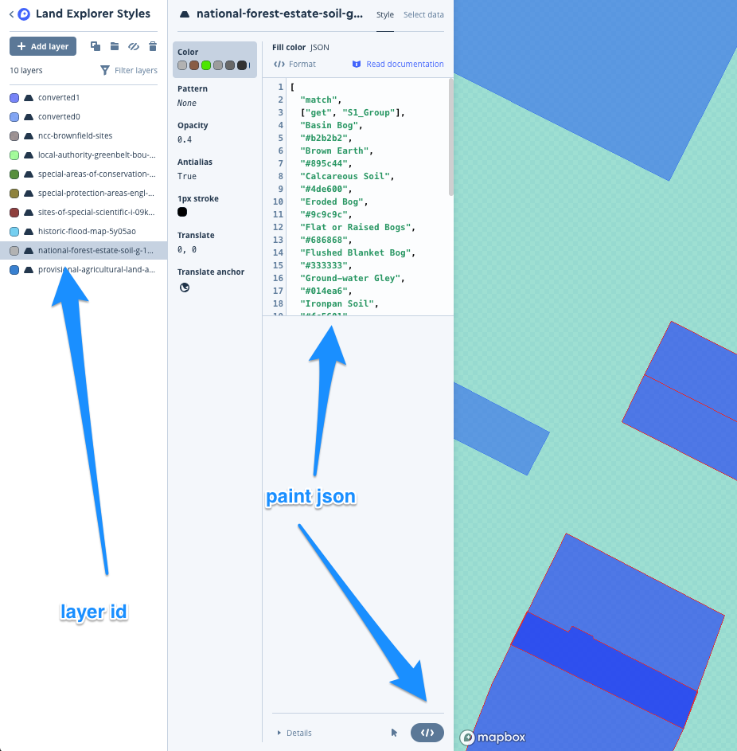

# Land Explorer Documentation (Front End)

This is the front-end of Land Explorer, intended to be used with the back-end, which can be viewed [here](https://github.com/DigitalCommons/land-explorer-back-end).

This is a Digital Commons Cooperative project. Please follow our [contributor guidelines](https://github.com/DigitalCommons#-contributing) if you wish to participate in building Land Explorer.

## Requirements

- Node 24
- Yarn 1.22

## Get Started

1. Clone this repo
2. `yarn install`
3. create a .env file in the config folder, copying and replacing the values in the .env.example
4. `yarn start`

## Mapbox 

#### Adding a new layer to the map

1) Create a new tileset in Mapbox Studio from .geojson, .shp or .mbtiles data
2) Create a new style layer in "Land Explorer Styles" using the new tileset as data source.
3) Get map id - (click on tileset menu -> map ID (looks like "joolzt.4i2tzpgj"))
4) Append map id to data/mapSources.js composite url
5) Append map id to MapLandDataLayers.js Source component (tileJsonSource url).
6) Add new Layer component to MapLandDataLayers.js
    * id is the style layer id (from Land Explorer Styles in mapbox studio, e.g. local-authority-greenbelt-bou-9r44t6)
    * sourceId is composite (as we appended it to the composite source url in the last step)
    * sourceLayer is the name of the source tileset (e.g Local_Authority_Greenbelt_bou-9r44t6)
    * paint is taken from the json of the style layer (</> icon in the menu)
    
    
    * fillOpacity is used to toggle the layers when active
        ```"fill-opacity": activeLayers.indexOf('historic-flood-map-5y05ao') !== -1 ? .4 : 0,```
7) Add new LandDataLayerToggle component to LeftPaneLandData.js, layerId is the style layer id (e.g. e.g. local-authority-greenbelt-bou-9r44t6)
8) Add layer key definition to `src/data/mapLayerKeyConfig.js`

<br/>

## Ordnance Survey
#### Creating an ordnance survey key

https://developer.ordnancesurvey.co.uk/
1) Create a new account
2) Complete profile
3) Accept terms and conditions
4) Choose a free trial plan for OS Maps for Enterprise api
5) Choose a free trial plan for OS Places api
6) Add one new key for OS Maps API Enterprise
7) Add one new key containing all 3 OS Places APIs
8) On next screen, click on the keys you just created to get the keys
9) Put keys in constants.js
