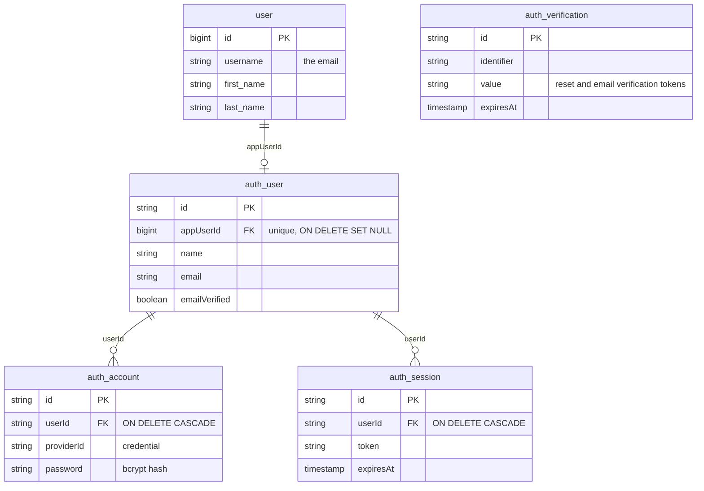

# Better Auth

We're replacing our in-house auth (a 365-day JWT with no sessions or revocation) with [Better Auth](https://better-auth.com), a self-hosted auth library. See the [auth spike](../spikes/how-to-approach-auth.md) for why.

The new auth sits behind a feature flag, so the old and new versions live side by side until we switch over.

- [Back end](back-end.md): Better Auth config, the Hapi auth strategy, websockets and tables
- [Emails](../back-end/emails.md): React Email templates, which all new emails should use
- [Front end](front-end.md): the auth client, Better Auth UI components, routes and 401 handling
- [Registration](registration.md): how sign-up writes our `user` table inside Better Auth's transaction
- [Migrating users](migrating-users.md): copying existing users into Better Auth and switching the flag on

## Environment variables

| Variable | App | Notes |
| --- | --- | --- |
| `FEATURE_USE_BETTERAUTH` | Back end | `true` to turn Better Auth on |
| `BETTER_AUTH_SECRET` | Back end | Signs cookies and tokens. At least 32 characters: `openssl rand -base64 32` |
| `BETTER_AUTH_URL` | Back end | The app's public base URL, which the browser uses for `/api/auth` (the front-end origin, e.g. `http://localhost:28080` locally). Links in emails are built from it |
| `VITE_FEATURE_USE_BETTERAUTH` | Front end | `true` to turn Better Auth on, at build time |
| `SENDGRID_API_KEY` | Back end | Already used. Without it, no verification emails are sent, so neither new nor migrated users can sign in |

## Tables

`user` is ours and the `auth_*` tables are Better Auth's. `auth_verification` isn't linked to the other tables: it holds password reset and email verification tokens.

- `user` is still the app user. Everything outside auth uses `user.id`.
- `auth_user.appUserId` links the two. The Hapi strategy and websockets read it as `user_id`, so a session with no `appUserId` is treated as signed out.
- All five tables are created by our Sequelize migrations (`apps/back-end/migrations/20260925*`), not Better Auth's CLI, so they run with `be-migrate` like everything else.
- Passwords are bcrypt hashes in `auth_account.password`. Better Auth is configured to use bcrypt, the same as the old auth, so existing hashes are copied across and users keep their passwords.

### Tech debt: duplicated user details

The email and name are stored twice: `user.username`, `first_name` and `last_name`, and `auth_user.email` and `name`. Sign-in uses `auth_user.email`, and the rest of the app uses `user`.

This is acceptable for now. It can be cleaned up later by making `auth_user` the only copy and removing the columns from `user`.

## Email verification

Users must verify their email before they can sign in. That includes migrated users: the first time they sign in, they're sent a verification link instead. See [back end](back-end.md#email-verification) and [Registration](registration.md).

## Removing the flag

Once Better Auth is live, search for `TODO` comments mentioning `FEATURE_USE_BETTERAUTH` or `VITE_FEATURE_USE_BETTERAUTH`. They help to mark what to delete.
