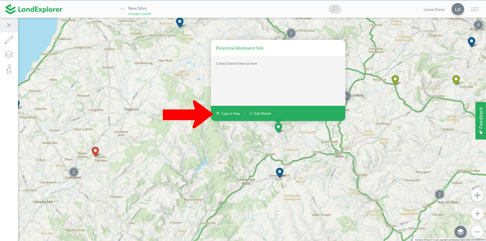
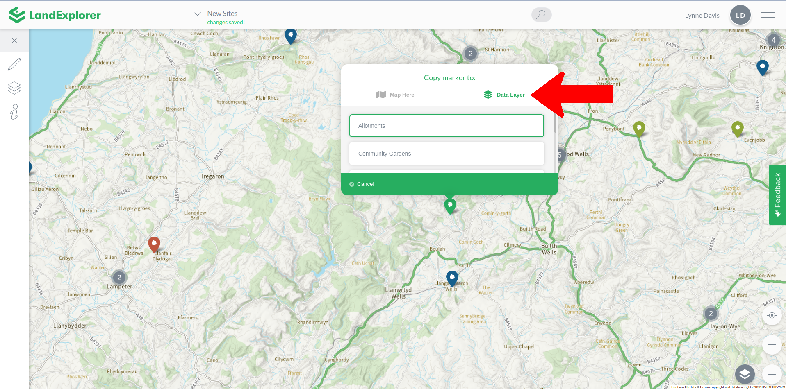

# Bespoke Data Layers

You can create data layers that contain your own data, and share this data either publicly or within closed groups. Bespoke Data Layers can contain markers, line and polygons, which can be toggled on and off like other [data layers](../left-toolbar/data-layers/) within LandExplorer. These elements can be drawn directly into LandExplorer using the [Drawing Tools](../left-toolbar/drawing-tools.md). And you can import data into bespoke data layers from other sources.

The Bespoke Data Layer functionality currently requires working closely with our support team. There is no user interface to create the user groups and import the data. Instead we do this on our servers directly. We do intend to create a full interface for this functionality, as and when the demand is high enough. In the meantime, if you would like to explore any of these features further [get in touch](mailto:landexplorer@digitalcommons.coop).

## User Groups & Data Groups

A Bespoke Data Layer is a set of data that can be accessed in the Data Layers menu, but is only visible to the people in your group or team - the User Group that you specify.

Within a Bespoke Data Layer you can have markers, lines and polygons, all with names and descriptions. These elements can be organised into Data Groups and colour coded to make it easier to navigate and understand at a glance.

To create a User Group & Data Group in [LandExplorer](https://app.landexplorer.coop), you will need:

* A list of all the people you would like to be able to access the data. Each person will need to create a [LandExplorer](https://app.landexplorer.coop) account.
* A list of all the elements you would like, organised into groups. For example, one group using [LandExplorer](https://app.landexplorer.coop) have created markers and polygons representing different community growing spaces in Wales. They are grouped into 'Community Gardens', 'Allotments', 'Community Orchards' etc.

<figure><figcaption></figcaption></figure>

## Adding & Editing Bespoke Data

There are two key ways that data in Bespoke Data Layers can be created and edited: by importing, and by manually adding from a map.

#### Importing Data

To import data into a Bespoke Data Layer will require support from the support team. We can import markers, lines and polygons with names and descriptions. We'll need a json, csv or data file that includes the following headings:

* Element Name
* Element Description
* (for markers) A single location, address or coordinates
* (for lines and polygons) A set of coordinates

Our support team can work technical magic, even if your data is messy or incomplete. So do [get in touch](mailto:landexplorer@digitalcommons.coop) to explore further.

#### Manually Adding Data

You can also use the [Drawing Tools](../left-toolbar/drawing-tools.md) to create your own data manually, then add this data to your own data layers.

Once you have [drawn](../left-toolbar/drawing-tools.md) a new [marker](../left-toolbar/drawing-tools.md#marker), [line](../left-toolbar/drawing-tools.md#line) or [polygon](../left-toolbar/drawing-tools.md#polygon), click Copy To Map, then from the Data Layers tab choose the data layer that you would like to add it to.

<figure><figcaption></figcaption></figure>

<figure><figcaption></figcaption></figure>


Pro Tip - You can also add data from Shared Data Layers to your own saved maps.


## Deleting Bespoke Data

If you would like to remove a marker, line or polygon from a Shared Data Layer, please [get in touch ](mailto:landexplorer@digitalcommons.coop)with the support team with the details of the data you would like removed.

## Making Bespoke Data Public

If your dataset might be helpful for communities and social movements more generally, you might like to consider making your Shared Data Layer public. A public data layer will be visible to all [LandExplorer](https://app.landexplorer.coop) users, but only people in your User Group will be able to edit or add data to these layers. To explore making your Shared Data Layer a public data layer, [get in touch](mailto:landexplorer@digitalcommons.coop).
