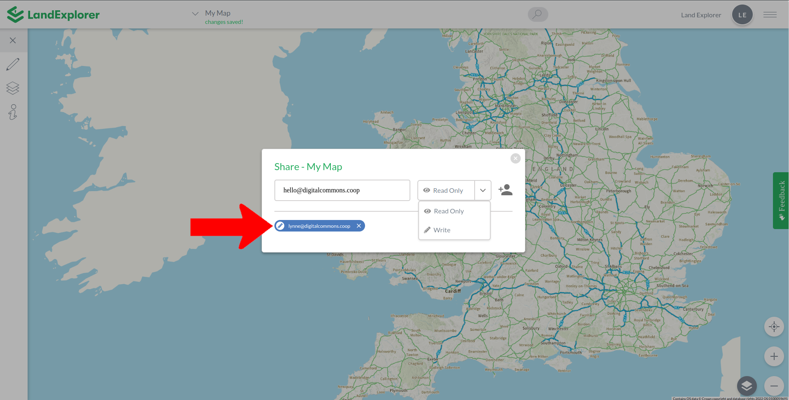
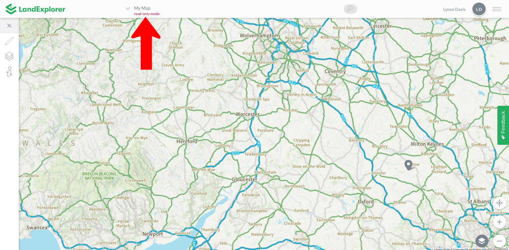
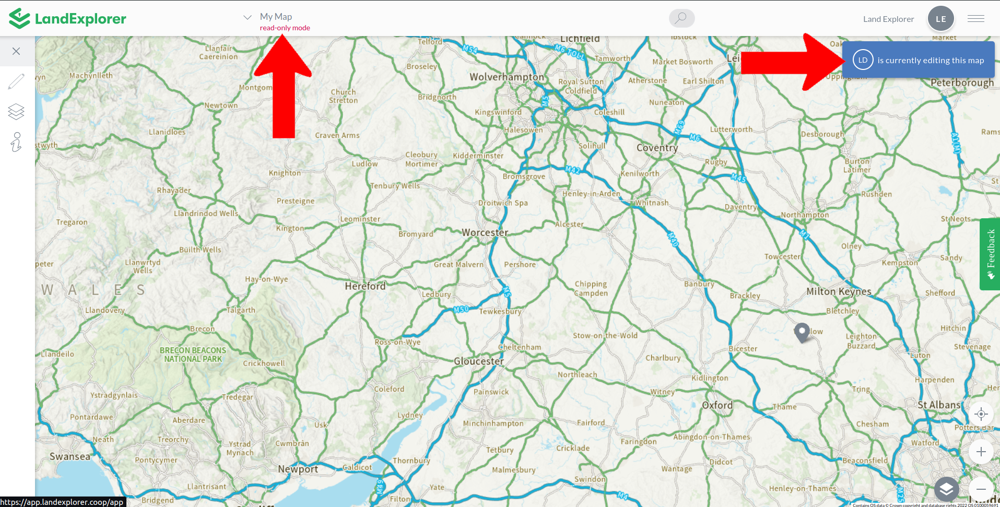
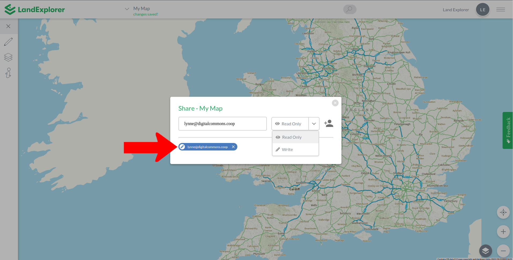

# Shared Maps

When working with a team or community it can be really helpful for multiple people to be able view and edit the same map.

Select [Share](../map-menu/exporting-and-sharing.md#share) from the [Map Menu.](../map-menu/) Enter an email address to share the map and select the permission level - Read Only access will not be able to edit the map, whereas sharing with Write access will enable the user to make edits. If the user doesn't already have a LandExplorer account, the map will be shared with them once they have created an account.

When you share the map you will have two options:

1. Read Only: When a map is shared in Read Only mode, the person you share the map with will not be able to edit it. They will be able to see all of the map contents, including description boxes.
2. Write: When a map is shared in Write mode, the person you share the map with will be able to edit it.&#x20;


While in Write mode only one person can edit the map at a time. If someone else is editing the map you will see a message letting you know. More information [here](shared-maps.md#write-permission).


You can see which of the people the map has already been shared with from the Share pop-up. The email addresses listed at the bottom in blue indicate the map has already been shared with these people.&#x20;

<figure><figcaption></figcaption></figure>

### Read Only Permission

To share a map with read only permission, enter the email address you would like to share the map with and select Read Only. This person will receive an email letting them know a map has been shared with them.

When a map is shared in read only mod you will see a notification under the map title letting you know the map is in read only mode.

<figure><figcaption></figcaption></figure>

When a map is shared with read only permissions, the people the map has been shared with will not be able to make any changes to the map or share the map with additional people. They can make copies and export the map. People with whom the map has been shared will not be able to delete the map. Only the person that created the map can delete the map.

### Write Permission

To share a map with write permission, enter the email address you would like to share the map with and select Write. This person will receive an email letting them know a map has been shared with them.

Only one person will be able to edit the map at a time. Editing is done on a first come first served basis. The first person to open the map and make an edit will then be the only person able to make edits until they have made no edits for 5 minutes. After 5 minutes have passed any person will be able to make edits. The next person to make an edit will be the only person to make edits for 5 minutes.

When someone else is editing the map your map will display in read only mode. You will also see a notification with the initials of the person making edits to the map.

<figure><figcaption></figcaption></figure>

When a map is shared with write permissions, the people the map has been shared with will be able to share the map with additional people and make copies of the map. People with whom the map has been shared will not be able to delete the map. Only the person that created the map can delete the map.


We've implemented map sharing in this way to simplify the technical difficulty while we learn more about what people would like from this feature. If you would like to suggest improvements, please [get in touch](mailto:landexplorer@digitalcommons.coop), or let us know via the [feedback form](../feedback.md).


### Updating Permissions

You can see whether a person has been granted read only or write permission from within the Share modal. The email addresses listed at the bottom in blue indicate the map has already been shared with these people. If there is an eye icon next to the email address, the map has been shared in read only mode. If there is a pencil icon, the map has been shared with write permission.&#x20;

To update the permissions, simply share with the email address again with the permissions you would like to update to.

<figure><figcaption></figcaption></figure>
