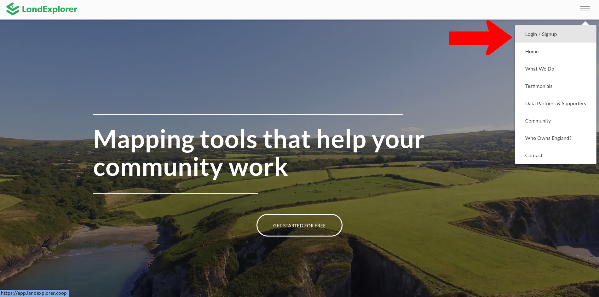
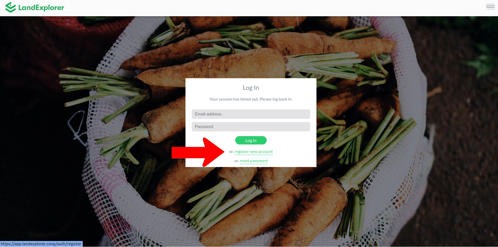
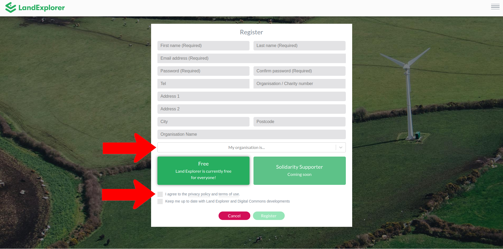

# Creating an Account

From the [LandExplorer homepage](https://landexplorer.coop), go to the top right corner, expand the menu and click 'Login / Signup'.

<figure><figcaption></figcaption></figure>

You can also access directly by going to [https://app.landexplorer.coop](https://app.landexplorer.coop).

## Login

If you already have an account, use your existing login details to login to [LandExplorer](https://app.landexplorer.coop). If you have forgotten your password, click 'reset password' to trigger an email with a link to reset it.&#x20;

## Register a new Account

To start using LandExplorer for the first time you need to create an account. If you don't yet have an account click 'register new account'.

<figure><figcaption></figcaption></figure>

Fill in the details to register your account. Note that most fields are optional - those that aren't say (Required) in the text field. \
\
Though optional, it helps us out to know the types of organisations using LandExplorer, so please do fill this in as best you can. You will need to check the box agreeing to our [Terms of Use.](https://digitalcommons.coop/terms-of-use/) Don't forget to sign up for our (infrequent, but high quality) newsletter to keep abreast of updates.

<figure><figcaption></figcaption></figure>


Why do I need to create an account?\
LandExplorer aims to make a range of data sets more widely available. Some of these data sets have license conditions associated with them. These are linked or outlined in the [LandExplorer Terms of Use](https://digitalcommons.coop/terms-of-use/). The reason we need people to create an account to use LandExplorer is to ensure that everyone agrees to our Terms of Use, so that we can be sure we are adhering to our license conditions. This helps us to make a wider range of data sets available.

