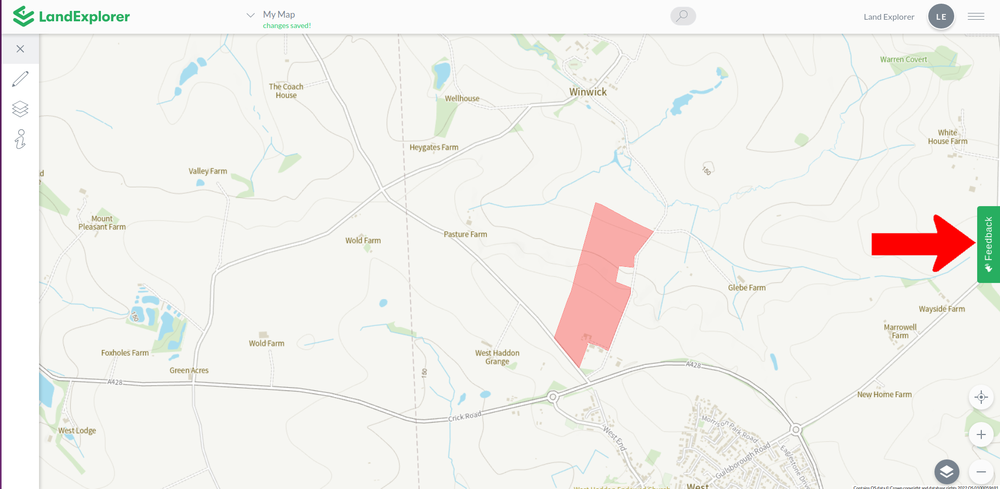
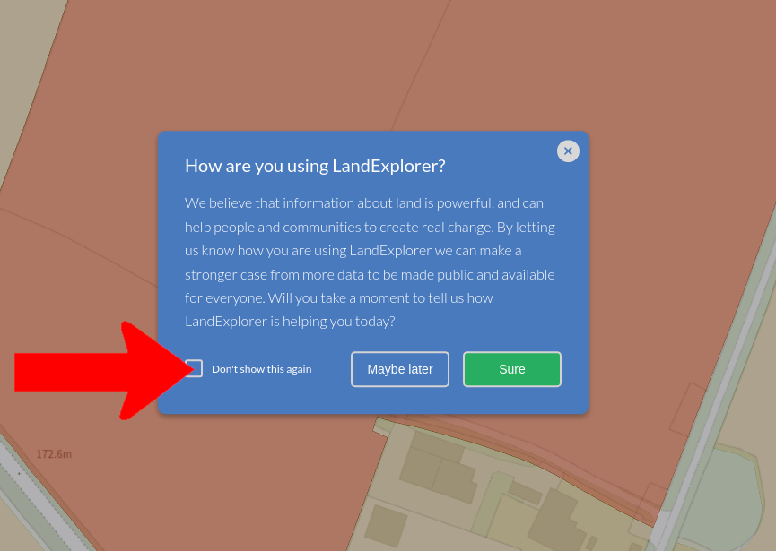

# Feedback

It's really important to us to understand how [LandExplorer](https://app.landexplorer.coop) is being used. We believe that information about land is powerful, and can help people and communities to create real change. By letting us know how you are using [LandExplorer](https://app.landexplorer.coop) we can make a stronger case from more data to be made public and available for everyone. It helps us to make the case to funders and potential partners that can help us continue to develop [LandExplorer](https://app.landexplorer.coop) for everyone.

Leaving feedback is a simple and great way to show your support.

You can find the Feedback form at any time on the right hand side.

<figure><figcaption></figcaption></figure>

While using the [Land Ownership layer ](left-toolbar/data-layers/land-ownership/)you might also be shown a popup asking you to leave feedback. This is because the Land Ownership functionality is a tool we particularly want to understand how it is being used.

If you'd like to stop this popup from showing in the future, just tick the 'Don't show this again' checkbox.

<figure><figcaption></figcaption></figure>

