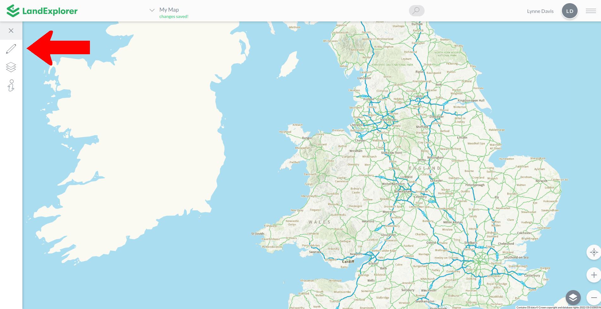
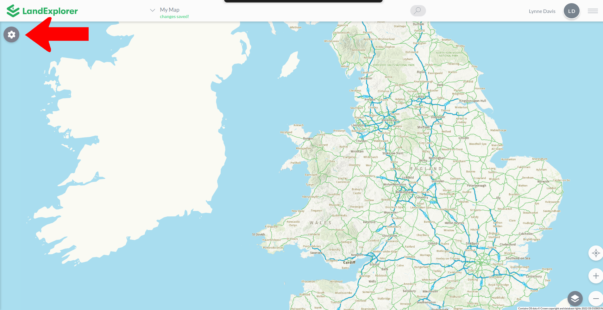

# Left Toolbar

The left toolbar enables you to change the map itself, either by turning layers on and off or drawing on it. It is also where you can find information about the specific drawing or selected areas of the map.

By default the left toolbar is expanded.

<figure><figcaption></figcaption></figure>

You can collapse the left toolbar by clicking the 'x'. You can then expand it again by clicking the cog.

<figure><figcaption></figcaption></figure>

For details about the different functions within the map menu see the sections on [Drawing Tools](drawing-tools.md), [Layers](data-layers/), [Map Info](land-information.md) and [Land Ownership](data-layers/land-ownership/).

