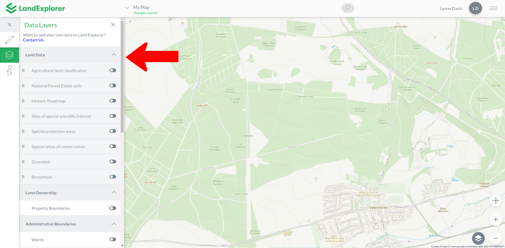

# Data Layers

Every map created in [LandExplorer](https://app.landexplorer.coop/) can be overlayed with additional data, to give a deeper understanding of the geographic and political context of the land. Our intention is to continue to develop the [LandExplorer](https://app.landexplorer.coop/) data layers to provide a rich source of data that can help communities and groups to understand and participate in the landscapes around them. If there is a data set or data layer that you would like to see in [LandExplorer](https://app.landexplorer.coop/), please [get in touch](https://landexplorer.coop/#contact).

<figure><figcaption></figcaption></figure>

The following is a list of all the data sets currently available in [LandExplorer](https://app.landexplorer.coop/).

### Land Data

**Agricultural land classification -** Natural England\
Provisional Agricultural Land Classification Grade. Agricultural land classified into five grades. Grade one is best quality and grade five is poorest quality. A number of consistent criteria used for assessment which include climate (temperature, rainfall, aspect, exposure, frost risk), site (gradient, micro-relief, flood risk) and soil (depth, structure, texture, chemicals, stoniness).

**National Forest estate soils** - Forestry Commission\
This vector dataset provides detailed (1:10,000) soil information for approximately half the Public Forest Estate.

**Historic flood map** - Environment Agency\
Historic Flood Map is a GIS layer showing the maximum extent of all individual Recorded Flood Outlines from river, the sea and groundwater springs and shows areas of land that have previously been subject to flooding in England.

**Sites of special scientific interest** - Natural England\
Sites designated by Natural England  to have features of special interest, such as its wildlife, geology or landform.

**Special protection areas** - Natural England\
Special Protection Areas (SPAs) are protected areas for birds in the UK. Currently only data for England is included in LandExplorer.

**Special areas of conservation** - Natural England\
Special Areas of Conservation (SACs) protect one or more special habitats and/or species – terrestrial or marine – listed in the Habitats Directive.

**Greenbelt** - DCLG\
Polygon dataset showing each English local authority's green belt land. Each local authority have digitised these sites in different ways and to different levels of accuracy.&#x20;

**Brown field -** Local Planning Authorities\
Local planning authorities designate sites in their area as being brownfield land, and publish a register of brownfield sites annually following GOV.UK guidance.

### Land Ownership

See the [Land Ownership](./#land-ownership) page for a full walk-through of this section.

**All Properties**\
Using this layer you can view land ownership information about properties in England and Wales. More information about this data layer can be found [here](land-ownership/how-do-we-identify-land-ownership.md). Note that you will need to zoom in to view this layer due to the large dataset.

**Local Authority**

Using this layer you can view properties that are owned by local authorities across England and Wales. Note that you will need to zoom in to view this layer due to the large dataset.

**Church of England**

Using this layer you can view properties that are owned by the CHurch of England across England and Wales. Note that you will need to zoom in to view this layer.

**Unregistered Land**

Using this layer you can view land that has not been registered with the Land Registry in England and Wales. A piece of land might not be registered for a number of reasons. It might be that there is no known owner of the land. But more likely it is that the land has not changed hands since 1990, when it became mandatory to register ownership of the land with the land registry when the title changed hands. Note that you will need to zoom in to view this layer due to the large dataset.

### Administrative Boundaries

**Wards**: Electoral districts or divisions or cities and towns in England and Scotland

**Parishes**: Includes English parishes and Welsh and Scottish Communities. The lowest tier of local government territorial organisation.

**Local councils:** Unitary councils, London and metropolitan boroughs, plus local authorities in Wales and Scotland.

**Parliamentary Constituencies**: Geographic areas designating the constituencies for members of the UK parliament.

**Devolved Powers**: Geographic areas designating constituencies for members of Welsh and Scottish parliament.

**Counties**: Administrative areas of England.

### Adding your own layers

It is also possible to add your own layers to [LandExplorer](https://app.landexplorer.coop). These can be from public datasets or private datasets, and can be made available to specific user groups, or to everyone. See [Collaborative Mapping](../../collaborative-mapping/) for more detail.
