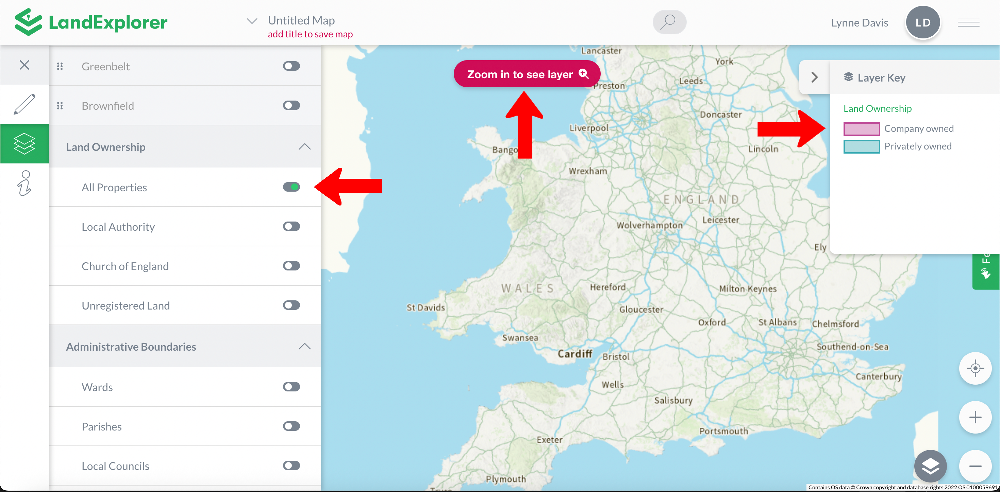
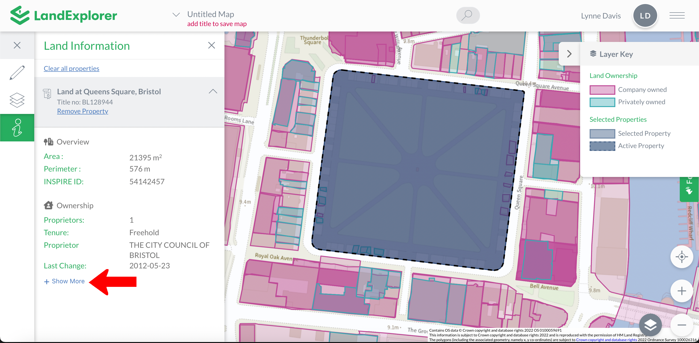
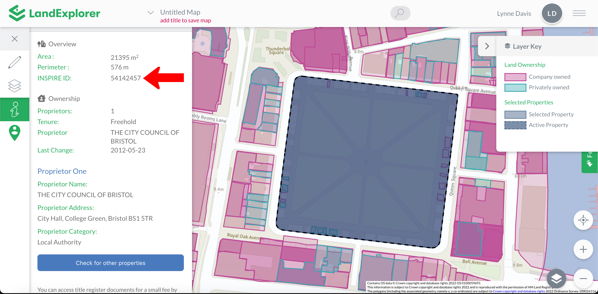
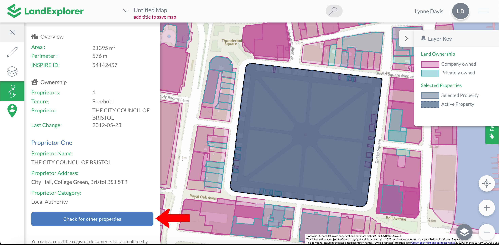
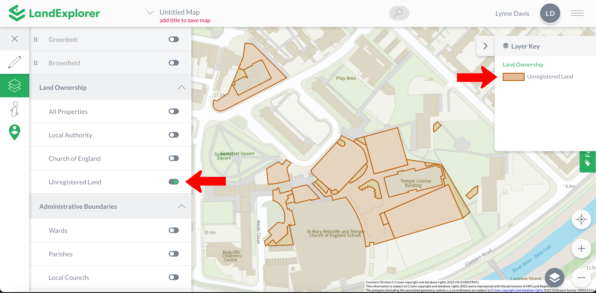

# Land Ownership

The Land Ownership layer enables you to find out information about land ownership across the UK. [LandExplorer](https://app.landexplorer.coop) combines INSPIRE property boundaries with Companies House data on UK and foreign companies that own land in the UK. You can find more about how [LandExplorer](https://app.landexplorer.coop) identifies land ownership [here](how-do-we-identify-land-ownership.md).

<figure><figcaption></figcaption></figure>

When you first toggle the Land Ownership layer on you will likely see a message asking you to zoom in. This dataset is huge, so to ensure the app functions well we restrict the land ownership search to relatively small regions at a time. Once you zoom in enough the message will disappear and you will see a transparent layer over the base layer.&#x20;

<figure><figcaption></figcaption></figure>

You can then click to find information about the boundary and ownership of the land. Use the key to indicate if the land is Company Owned or Privately Owned.

For Company Owned properties you will find infromation about the proprietors and tenure. Click the Show More button to view all the available information. Note that a single property might have multiple proprietors associated - multiple leaseholds and freeholds. Freeholds and leaseholds might also be spread across multiple property areas.

<figure><figcaption></figcaption></figure>

For privately owned properties you can find ownership information by taking the INSPIRE ID or Title Number and searching the [Land Registry](https://search-property-information.service.gov.uk/search/search-by-inspire-id). A small fee is payable to download the title information.

<figure><figcaption></figcaption></figure>

The 'Check for Other Properties' button will search the database to find other properties that are owned by the same proprietor.

<figure><figcaption></figcaption></figure>

After clicking the 'Check for Other Properties' buton a new panel will be displayed to help navigate the ownership search functionality. If this proprietor owns other properties a list of other properties owned by this proprietor will be displayed. You can then use the arrow button to go to that property. You can click on the properties to select them. After selecting a property you can zoom out to view a map with all of this proprietors properties highlighted.

<figure><figcaption></figcaption></figure>

There is a third option for Land Ownership, and that is land for which the ownership has not been registered with the Land Registry. This is unregistered land. A piece of land might not be registered for a number of reasons. It might be that there is no known owner of the land. But more likely it is that the land has not changed hands since 1990, when it became mandatory to register ownership of the land with the land registry when the title changed hands.

You can view unregistered land across England and Wales using the Unregistered Land layer. This will appear highlighted in a different colour as per the key.

<figure><figcaption></figcaption></figure>

