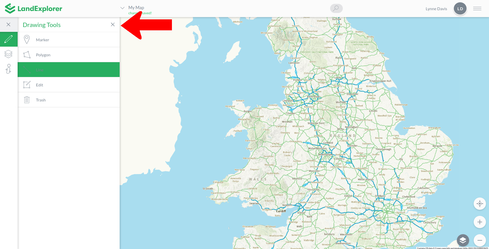

# Drawing Tools

The drawing tools are the first option on the left toolbar. Find them by clicking the pencil icon. Once expanded you can see the following drawing options: [Marker](drawing-tools.md#marker), [Line](drawing-tools.md#line), [Poly](drawing-tools.md#poly), [Edit](drawing-tools.md#edit) and [Trash](drawing-tools.md#trash).

<figure><figcaption></figcaption></figure>

### Marker

A marker is a single, geolocated point. Markers have latitudinal and longitudinal coordinates, along with a name and description. To create a marker, click on the 'Marker' option then go back to the map and click a place to locate it. To find a specific point or place you may want to [zoom](../map-functions/zoom.md) or [search](../map-functions/search.md) for a precise location.

Once you have drawn your marker you can find the coordinates of the marker by going to the [Map Info ](land-information.md)section. You can also add a name and description by clicking 'Edit Marker' then clicking on the text you would like to change. When you have finished editing press 'Save' to store your changes, or cancel to discard them.

<figure><figcaption></figcaption></figure>

Beside the 'Edit Marker' option is an option 'Copy to Map'. You can find details on the 'Copy to Map' functionality in [Collaborative Mapping.](../collaborative-mapping/)

### Line

A line is a series of geolocated points, linked together as the crow flies. You can use lines to mark routes or edges, for example paths or fence lines. To create a line, click on the 'Line' option then go back to the map and click a place to create your starting point. To find a specific point or place you may want to [zoom](../map-functions/zoom.md) or [search](../map-functions/search.md) for a precise location. Then click along the map tracing the line you want to mark. The line will connect in a straight line from the last click, so winding lines will require a lot of clicks to be accurate. To finish drawing the line, click in the same place twice. This will mark the end of the line.

Once you have drawn your line you can find the coordinates and length of the line by going to the [Map Info ](land-information.md)section. You can also add a name and description by clicking 'Edit Marker' then clicking on the text you would like to change. When you have finished editing press 'Save' to store your changes, or cancel to discard them.

<figure><figcaption></figcaption></figure>

Beside the 'Edit Marker' option is an option 'Copy to Map'. You can find details on the 'Copy to Map' functionality in [Collaborative Mapping.](../collaborative-mapping/)

### Polygon

A polygon is a series of geolocated points, linked together as the crow flies, that connect together to form an enclosed area. You can use polygons to mark areas or boundaries, for example property or field boundaries. To create a polygon, click on the 'Polygon' option then go back to the map and click a place to create your starting point. To find a specific point or place you may want to [zoom](../map-functions/zoom.md) or [search](../map-functions/search.md) for a precise location. Then click along the map tracing the line of the edge of the polygon you want to mark. The edge line will connect in a straight line from the last click, so complex boundaries with uneven edges will require a lot of clicks to be accurate. To finish drawing the polygon, click back in the starting place. This will complete the edge line and close it to create a polygon.

Once you have drawn your polygon you can find the coordinates, perimeter length and area of the polygon by going to the [Map Info ](land-information.md)section. You can also add a name and description by clicking 'Edit Marker' then clicking on the text you would like to change. When you have finished editing press 'Save' to store your changes, or cancel to discard them.

<figure><figcaption></figcaption></figure>

Beside the 'Edit Marker' option is an option 'Copy to Map'. You can find details on the 'Copy to Map' functionality in [Collaborative Mapping.](../collaborative-mapping/)

### Edit

The Edit option allows you to make changes to an existing Marker, Line or Polygon. To Edit a line, marker or polygon, click on the Edit option, then click on the drawn element you wish to edit. It will highlight and you will be able to drag and drop any of the geolocated points that make up this drawn element to move them to a new location.

### Trash

The Trash option allows you to delete an existing Marker, Line or Polygon. To delete a line, marker or polygon click on the drawn map element to highlight it. Then click on the Trash option. It will be immediately deleted


Be careful. You will not be asked to confirm if you wish to delete the highlighted line, marker or polygon. This action is permanent.

