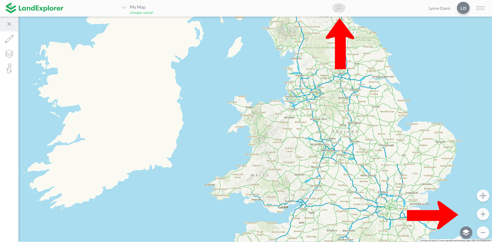

# Map Functions

This section explore the general map functions that help you to navigate maps in [LandExplorer](https://app.landexplorer.coop): [zooming](zoom.md) in and out, [searching](search.md) maps for addresses and locations and changing the [base layer tilesets ](base-tilesets.md)between arial view and topographical view. These functions can be found in the locations pointed on the following image.

<figure><figcaption></figcaption></figure>
