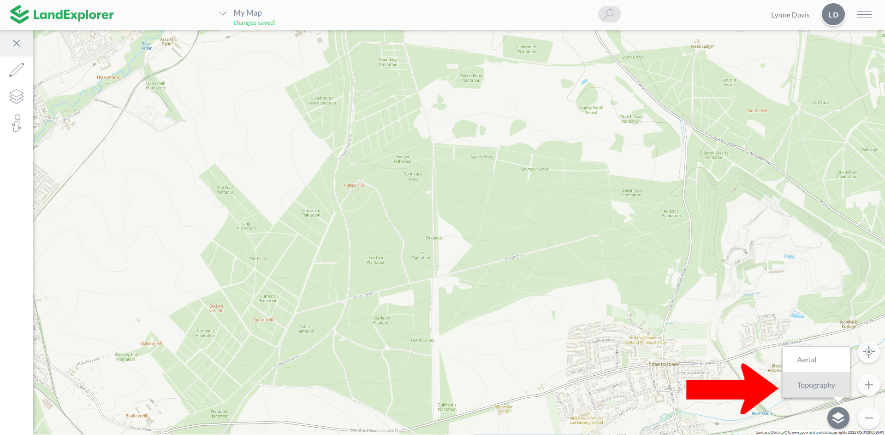

# Base Tilesets

Base layer tilesets form the background or base of the map. In LandExplorer there are two base layer tilesets to choose from. You can choose the tileset you wish to display as the base layer using the selector at the bottom right of the screen.

<figure><figcaption></figcaption></figure>

The default base layer tileset is the topographical view. The following image shows an area of Sherwood Forest with the topographical view.

<figure><figcaption></figcaption></figure>

Optionally you can change to an aerial tileset that displays satellite imagery. The following image shows the same area of Sherwood Forest with the aerial view.

<figure><figcaption></figcaption></figure>

