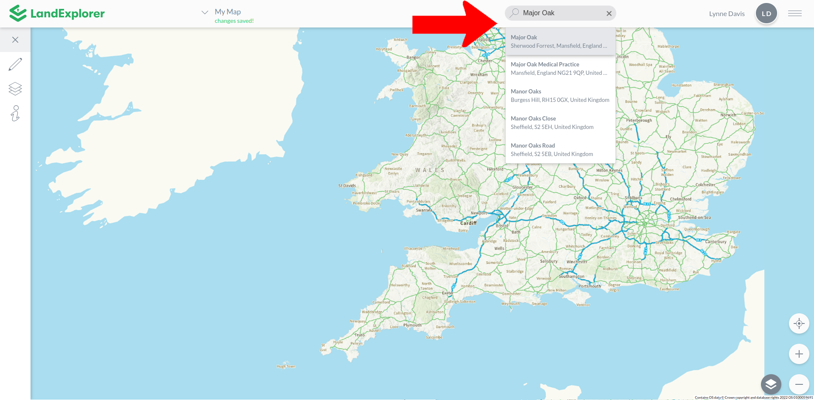

# Search

Use the search bar to quickly find a specific location on the map, or track down all the properties owned by a particular company. Click the search icon to expand it, then start typing.

You can search for:

* Addresses and postcodes
* Towns and places
* Landmarks and buildings
* Company names

As you type, LandExplorer will show matching results for you to choose from.

<figure><figcaption></figcaption></figure>


