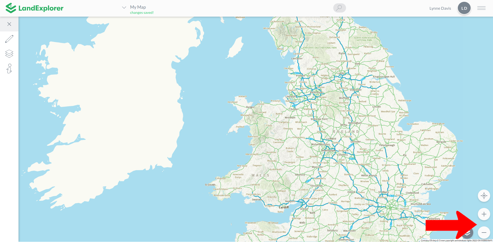

# Zoom

There are three main ways to zoom in or out on maps using [LandExplorer](https://app.landexplorer.coop).

1. You can zoom in and out using the roller on your mouse. On mobile you can zoom by pinching or separating two fingers on the screen.
2. You can double click an area of the map to zoom in on that location. There is no click action to zoom out.
3. You can use the + and - symbols in the bottom right hand corner.

<figure><figcaption></figcaption></figure>
