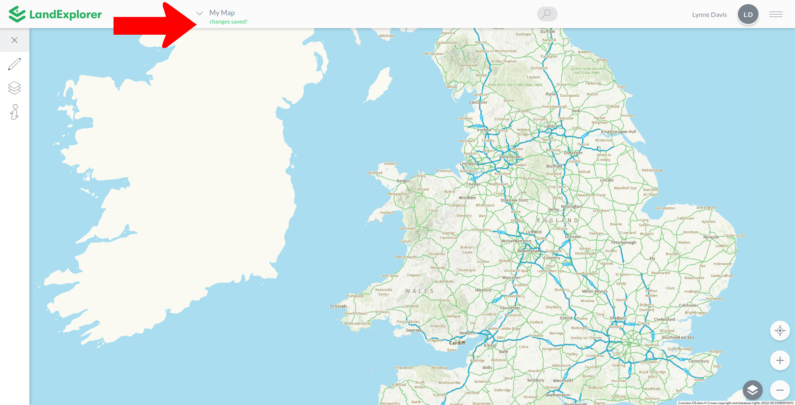

# Map Menu

The map menu enables you to perform basic document style functions on a map, such as saving, creating a new map, sharing and exporting.

Find the Map Menu by clicking the arrow next to the the map name. Before you name your map this will say 'Untitled Map'.&#x20;

<figure><figcaption></figcaption></figure>

'New', 'Open' and 'Save a copy' functions are explored in the [Basic Functions](basic-functions.md) section of the user guide.

'Create Snapshot', 'Share', 'Export Shapefile' and 'Generate GeoJSON' functions are explored in the [Exporting & Sharing](exporting-and-sharing.md) section of the user guide.
