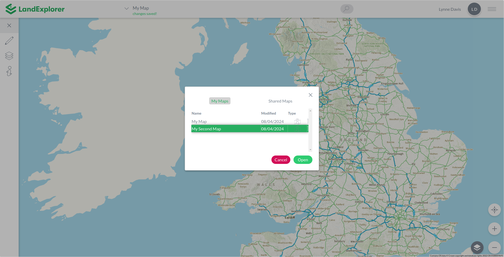

# Basic Functions

The following basic functions can be access via the Map Menu. For instructions on the 'Create Snapshot', 'Share', 'Export Shapefile' and 'Generate GeoJSON' functions , see the [Exporting & Sharing](exporting-and-sharing.md) section of the user guide.

Access these options by clicking the arrow beside the map title (if you haven't named the map it will say 'Untitled Map').

<figure><figcaption></figcaption></figure>

### New

Each time you log into [LandExplorer](https://app.landexplorer.coop) you will see a new, blank map called 'Untitled Map'. Once you save a map, or open a saved map, you can start again on a fresh map with this option.

### Open

This will allow you to open any of the maps you have previously saved or that have been shared with you. This menu item will open a small popup from which you can choose which map you would like to open. Toggle between the My Maps and Shared Maps tabs to see all the maps you have access to. Note that you can also delete maps from this window using the rubbish bin icon.&#x20;

<figure><figcaption></figcaption></figure>

### Save a copy

Maps are saved automatically when you are connected to the internet. However if you want to save a copy of a map, so that you can make changes but keep the current map state, you can do so with the 'Save a copy' menu option. This will open a popup asking if you would like to save a copy. When you click save the new map will be saved with the words 'Copy of' in front of the map title. You can then rename this map by clicking on the title and typing a new name.
