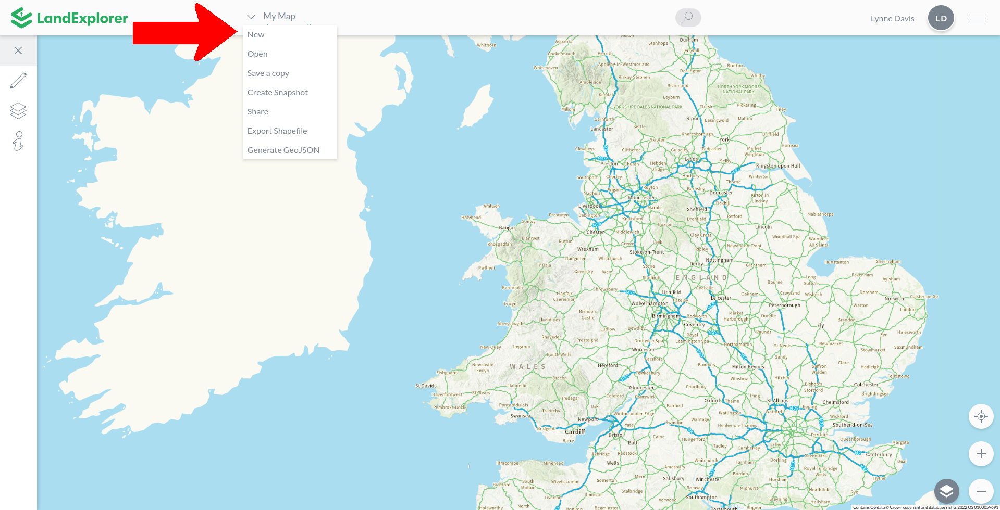
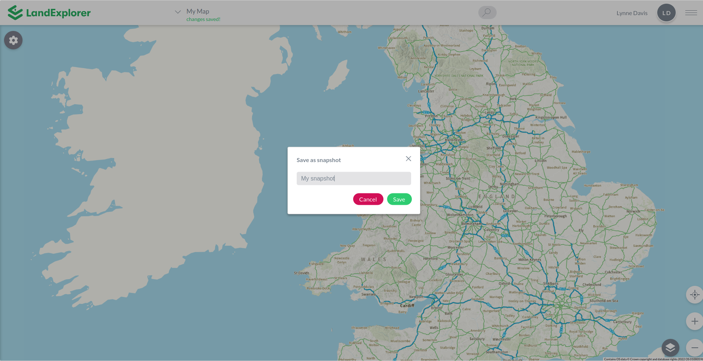
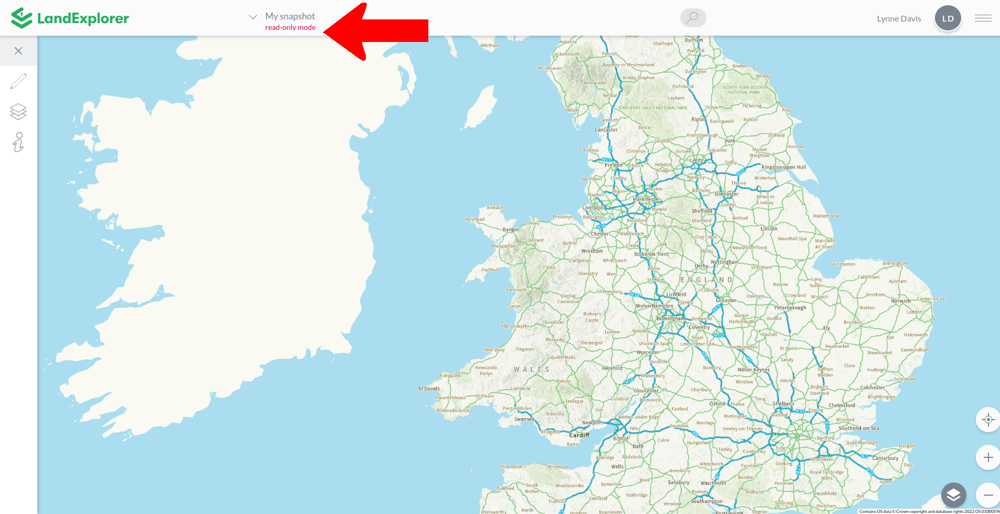
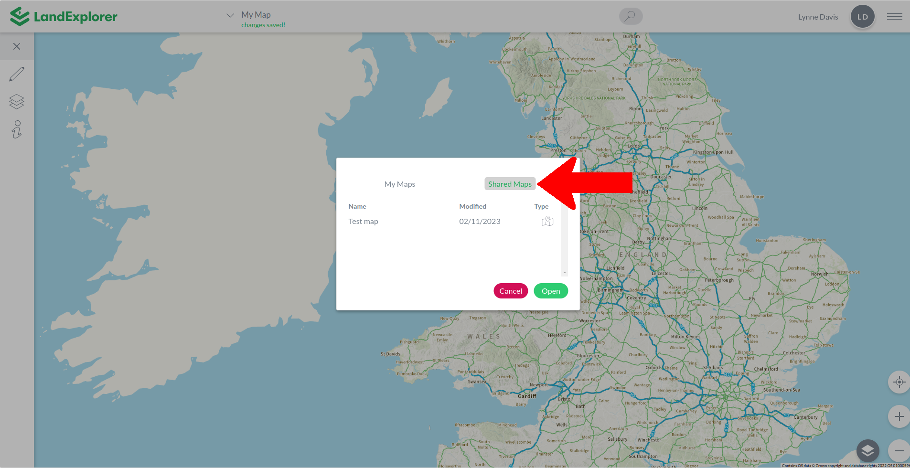
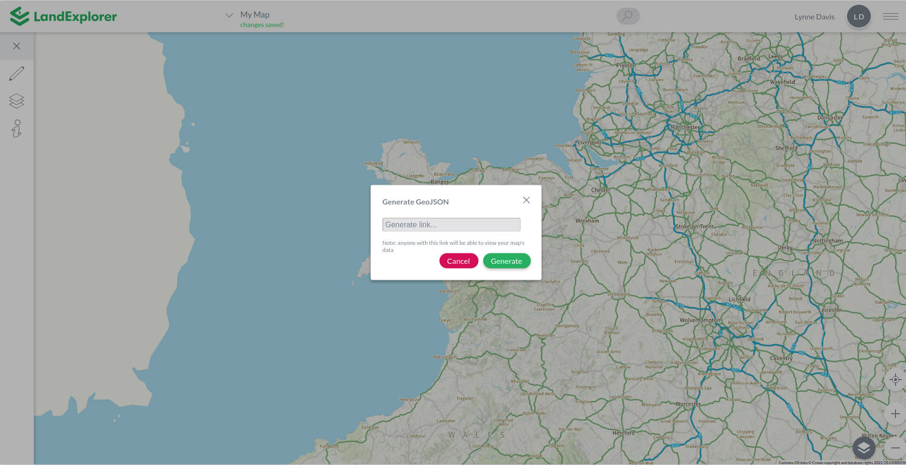

# Exporting & Sharing

The following Exporting and Sharing functions can be accessed via the Map Menu. For instructions on the 'New, 'Open' and 'Save a copy' functions , see the [Basic Functions](basic-functions.md) section of the user guide.

Access these options by clicking the arrow beside the map title (if you haven't named the map it will say 'Untitled Map').

<figure><figcaption></figcaption></figure>

### Create Snapshot

This option enables you to create an non-editable map that can be shared and saved. As the name suggests, a snapshot is a version of your map frozen in time. Potential snapshot applications might be if you are collecting data over time and want to be able to compare between multiple moments in time.&#x20;

<figure><figcaption></figcaption></figure>

Save the snapshot with a name. After you save it the current map view will change to the snapshot. You'll see the map is in read-only mode now.

<figure><figcaption></figcaption></figure>

You can go back to the editable version of the map using the [Open](basic-functions.md#open) menu option to navigate to the previous map. You can also use this menu to open the snapshot at a later date. Snapshots can be [Shared](exporting-and-sharing.md#share) in the same way that maps can.

### Share

You can share your maps with other LandExplorer users. When you select Share from the [Map Menu ](./)you will see all of the email addresses this map is already shared with. Enter an email address to share the map and select the permission level - Read Only access will not be able to edit the map, whereas sharing with Write access will enable the user to make edits. If the user doesn't already have a LandExplorer account, the map will be shared with them once they have created an account.

<figure><figcaption></figcaption></figure>

You can see all the maps that are shared with you. Click [Open](basic-functions.md#open) from the Map Menu and then click on the Shared Maps tab. This will show you a list of all maps that have been shared with you.

<figure><figcaption></figcaption></figure>

See [Collaborative Mapping - Shared Maps](../collaborative-mapping/shared-maps.md) for more information about sharing maps and editing shared maps.


With Write permissions on a shared map, other users will be able to make permanent changes to your map.&#x20;



Write permissions does not enable two users to be able to concurrently edit the same map. See [Collaborative Mapping - Shared Maps](../collaborative-mapping/shared-maps.md) to learn more.


### Export Shapefile

A Shapefile is a commonly used standard file format for geospatial data. Creating a shapefile from your map will allow your data to be readily imported into other mapping applications.

You will be directed to save your map before you export a shapefile. The shapefile will be exported as a zipped folder containing a number of files. You can then open these files using another mapping application.


If you haven't yet added any drawn elements or activated any exportable layers, the shapefile generated will be empty.


### Generate GeoJSON

GeoJSON is an open standard format designed for representing simple geographical features, along with their non-spatial attributes, in JSON script. GeoJSON can be imported into other mapping tools, or parsed via scripts to enable your map data to be used in non-mapping contexts. Generating GeoJSON will generate a URL that can be used to access your map data.

<figure><figcaption></figcaption></figure>

A simple example of GeoJSON output might look as follows:

```
{
  "type": "FeatureCollection",
  "features": [
    {
      "type": "Feature",
      "geometry": {
        "type": "Point",
        "coordinates": [
          -3.58324302648694,
          53.06582328913396
        ]
      },
      "properties": {
        "name": "Marker",
        "description": "",
        "group": "My Drawings"
      }
    }
  ]
}
```



Once you generate a GeoJSON link, anyone with the link will be able to access your map data.

