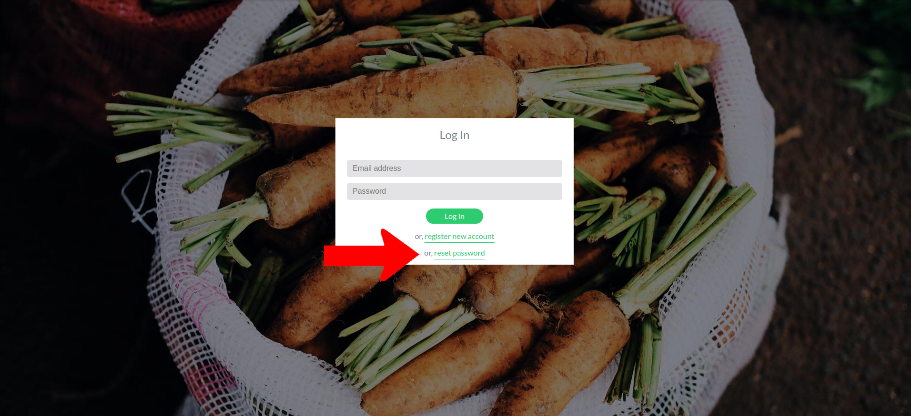

# Troubleshooting

## Forgotten Password

If you've forgotten your password, use the reset password link on the [login screen ](https://app.landexplorer.coop)to trigger a password reset email.

<figure><figcaption></figcaption></figure>

Enter your email address and press Reset.

<figure><figcaption></figcaption></figure>

If there is an account associated with this email address, an email will be sent to this address with a link. Clicking the link will take you to a page to input a new password.

<figure><figcaption></figcaption></figure>

Enter your new password and press save changes. You'll be redirected into the LandExplorer app.

## Everything Else

If something doesn't seem to be working as you expect, or there's a feature you'd like to see, please do [get in touch.](mailto:landexplorer@digitalcommons.coop) We'd love to hear from you!
