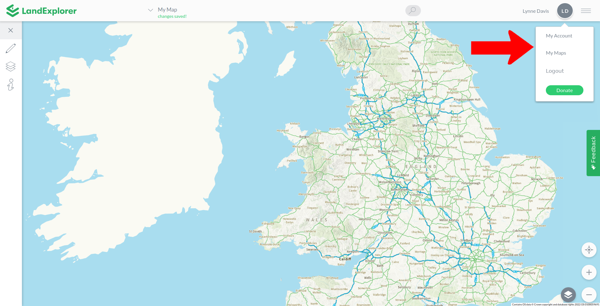
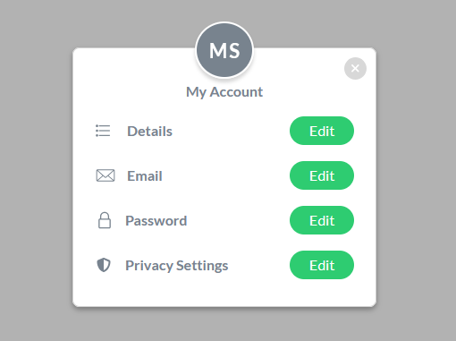

# User Settings

User settings are found in the top right hand corner of the app. This is where you can make changes to your account, access your maps, logout, and contribute toward LandExplorer.

<figure><figcaption></figcaption></figure>

## My Account

The My Account area allows you to update your account information and settings. You can change any of the **Details** that you entered when you registered your account, the **Email** address associated with your account, your **Password** and **Privacy Settings**.

<figure><figcaption></figcaption></figure>

### Resetting your Password

To reset your password, go to the [User Settings](user-settings.md) menu (see image above) and select [My Account](user-settings.md#my-account), then Password - Edit.  Alternatively, if you are logged into your [LandExplorer](https://app.landexplorer.coop) account you can [click here](https://app.landexplorer.coop/app/my-account/password) to go directly to the Reset Password page.

Reenter your new password twice and press Save Changes. Your password has now been updated.

### Privacy Settings

The **Privacy Settings** area allows you to manage whether analytics are turned on or off for your account. We use pseudonymous\* analytics to understand how people use [Land Explorer](https://app.landexplorer.coop/) and improve the service.

To update your analytics setting, go to [User Settings](user-settings.md) → My Account → Privacy Settings → Edit. Use the toggle switch to turn analytics on or off, then select Save Changes.

\*Pseudonymous means analytics data may be linked to an identifier, but not to your real name.

## My Maps

This will allow you to open any of the maps you have previously saved or that have been shared with you. This menu item will open a small popup from which you can choose which map you would like to open. Toggle between the My Maps and Shared Maps tabs to see all the maps you have access to. Note that you can also delete maps from this window using the rubbish bin icon.&#x20;

<figure><figcaption></figcaption></figure>

## Logout

This will log you out of your LandExplorer account. You can [log in](creating-an-account.md#login) again using your email and password.

## Donate

The donate button takes you to our [Open Collective](https://opencollective.com/digitalcommonscoop) page where we accept financial contributions towards [LandExplorer](https://app.landexplorer.coop)'s upkeep and development. [LandExplorer](https://app.landexplorer.coop) is a free to use, open source project that aims to make land data freely available for communities, activists and movements. If you find [LandExplorer](https://app.landexplorer.coop) useful and/or believe in our vision, please consider [contributing](https://opencollective.com/digitalcommonscoop).
